<div align="center">

# 🧠 ربات هوش مصنوعی کیسان نسخه ۲.۰۵

**ربات تلگرام چندزبانه هوش مصنوعی — ۵۰+ قابلیت**

[](https://python.org)
[](https://docs.aiogram.dev)
[](LICENSE)
[](Dockerfile)
[](tests/)

[فارسی](README_FA.md) | [English](README.md) | [کوردی](README_KU.md)

> کردی سۆرانی / فارسی / انگلیسی — با قدرت OpenRouter

</div>


## 📸 اسکرین‌شات‌ها

<div align="center">
<table>
<tr>
<td align="center"><br><b>لوگوی ربات</b></td>
<td align="center">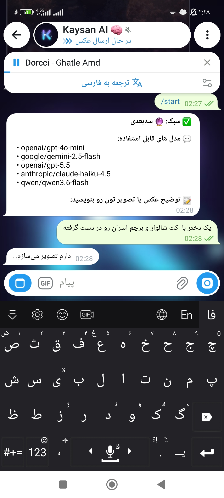<br><b>منوی اصلی</b></td>
<td align="center">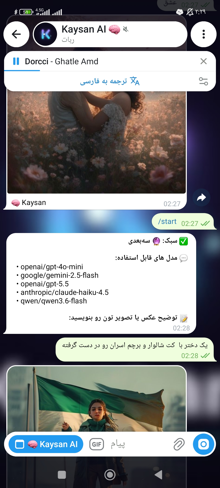<br><b>رابط چت</b></td>
</tr>
<tr>
<td align="center">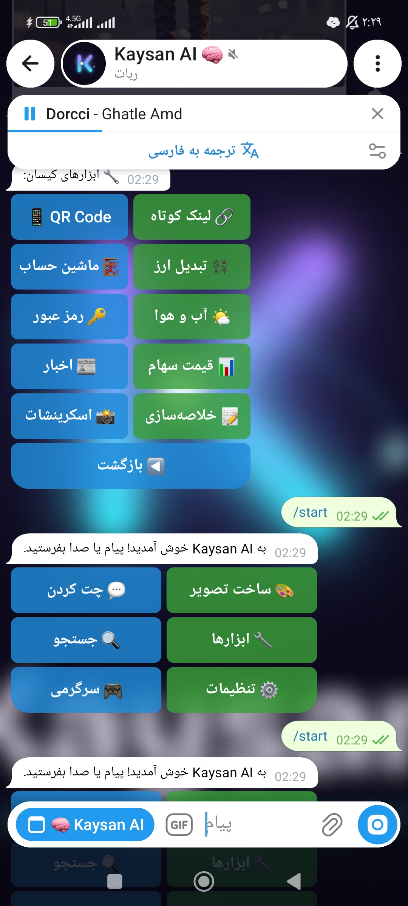<br><b>انتخاب مدل</b></td>
<td align="center">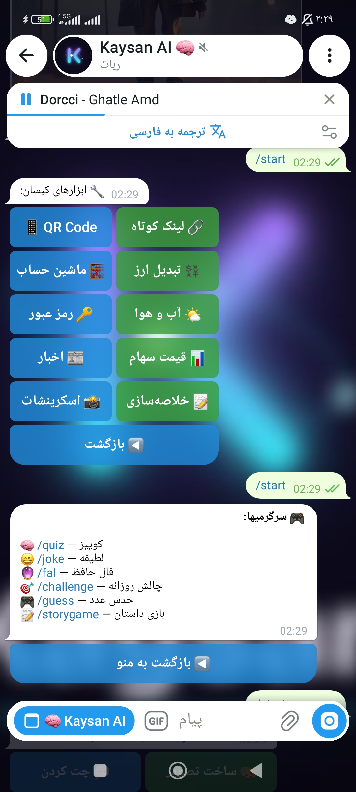<br><b>تنظیمات</b></td>
<td align="center">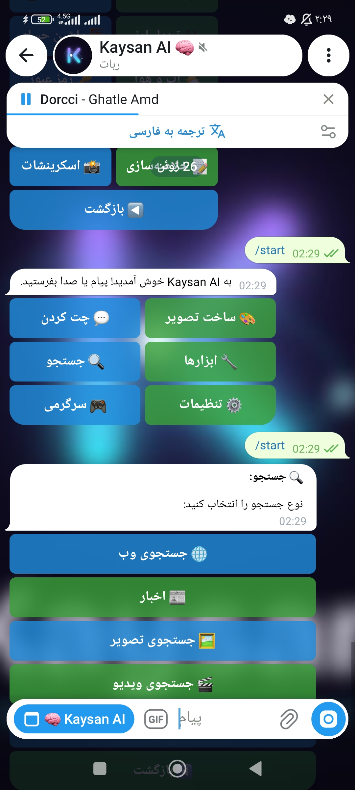<br><b>منوی زبان</b></td>
</tr>
<tr>
<td align="center">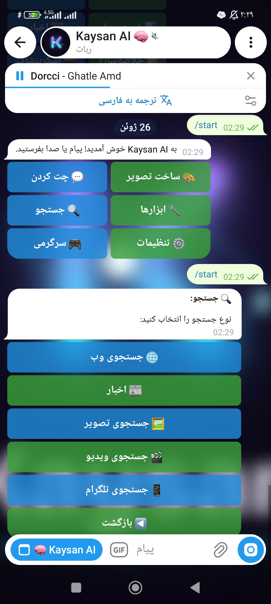<br><b>تولید تصویر</b></td>
<td align="center">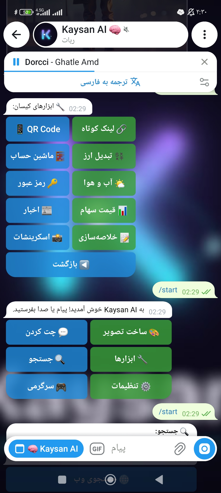<br><b>دستیار کدنویسی</b></td>
<td align="center">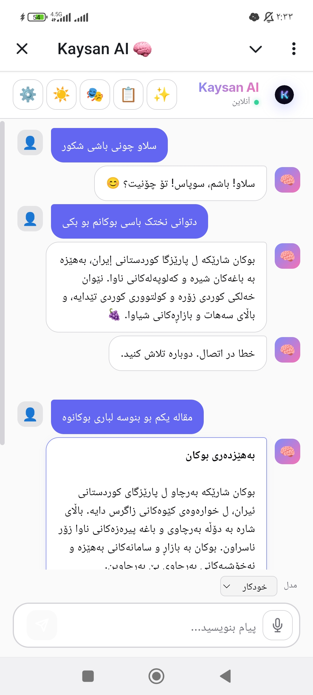<br><b>مینی‌اپ</b></td>
</tr>
<tr>
<td align="center">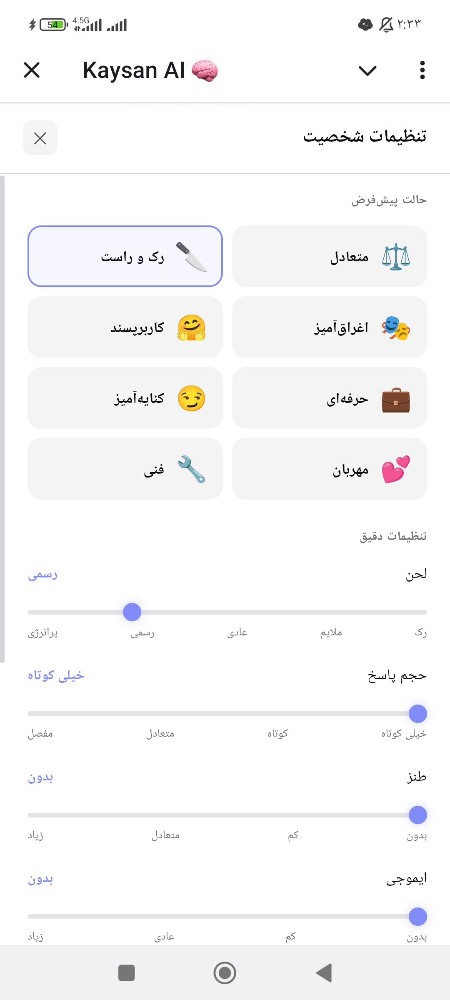<br><b>داشبورد وب</b></td>
<td align="center">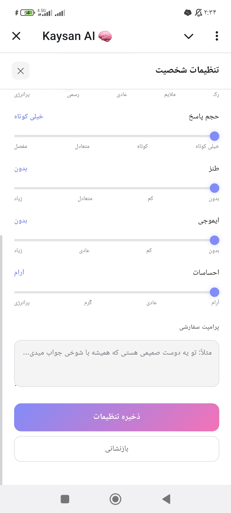<br><b>آمار</b></td>
<td align="center">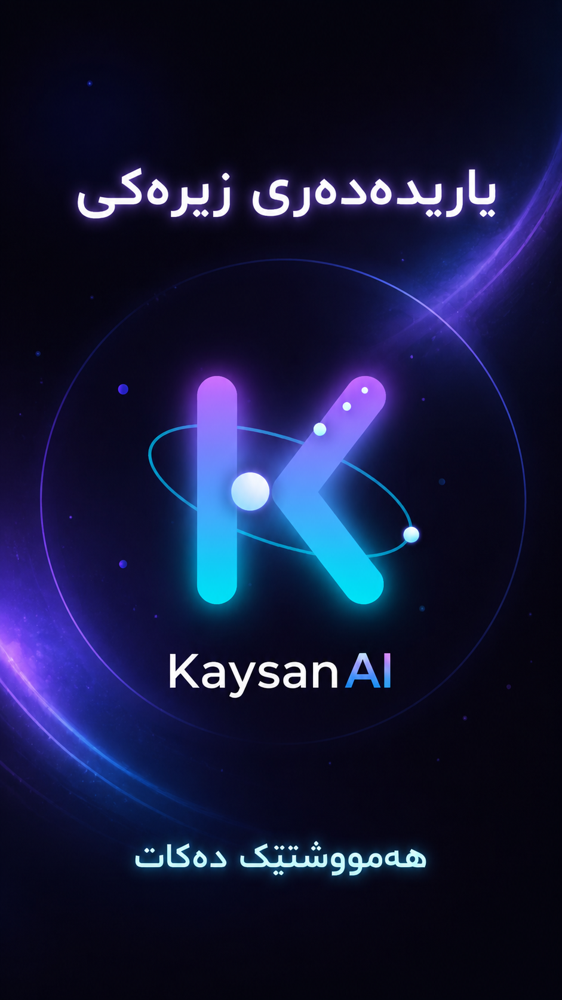<br><b>پاسخ ربات</b></td>
</tr>
</table>
</div>

---
## ✨ قابلیت‌ها

### 🤖 چت هوش مصنوعی
- **چند مدلی**: DeepSeek, GPT-4o-mini, Claude, Gemini
- **پاسخ streaming**: تحویل بلادرنگ
- **بهبود پرامپت هوشمند**: بهینه‌سازی خودکار درخواست‌ها
- **حافظه مکالمه**: یادآوری تاریخچه
- **۳ زبان**: کردی سۆرانی، فارسی، انگلیسی

### 🎨 ساخت تصویر
- **۱۷+ API رایگان**: Pollinations, Together, HuggingFace, Prodia
- **۱۲ سبک هنری**: واقعی، انیمیشنی، کارتونی، آبرنگ، روغنی، پیکسلی، سه‌بعدی، کمیک، مینیمال، سایبرپانک، فانتزی، اسکچ
- **بهبود پرامپت**: بهبود خودکار توضیحات تصویر

### 🔍 جستجوی هوشمند
- **جستجوی وب**: ادغام DuckDuckGo
- **جستجوی اخبار**: جمع‌آوری اخبار لحظه‌ای
- **جستجوی تصویر**: کشف محتوای بصری
- **جستجوی ویدیو**: کشف محتوای ویدیویی
- **جستجوی تلگرام**: جستجوی محتوای کانال
- **کش هوشمند**: SQLite + Redis fallback

### 🔧 ۲۰+ ابزار کاربردی
- **سازنده QR Code**
- **کوتاه‌کننده لینک**
- **ماشین حساب** (امن مبتنی بر AST)
- **تبدیل ارز**
- **سازنده رمز عبور**
- **قیمت سهام**
- **پیش‌بینی آب و هوا**
- **ابزار اسکرینشات**
- **متن به تصویر**
- **سازنده میم**
- **سازنده فاکتور**
- **فلش کارت**
- **پیگیری عادت‌ها**
- **ثبت هزینه‌ها**
- **برنامه‌ریز سفر**
- **جستجوگر دستور غذا**
- **خلاصه اخبار**
- **چالش روزانه**
- **نظرسنجی پیشرفته**
- **بازی حدس عدد**

### 👥 مدیریت گروه
- **پیام خوش‌آمدگویی/وداع**
- **فیلتر اسپم**
- **فیلتر کلمات نامناسب**
- **محافظت در برابر flood**
- **حالت آهسته**
- **پاسخ خودکار به کلمات کلیدی**
- **پاسخ به منشن ربات**
- **تحلیل عکس**
- **تحلیل فایل**
- **تبدیل صدا به متن**

### 🎮 سرگرمی و تفریح
- **کوییز علمی**
- **لطیفه**
- **فال حافظ**
- **چالش‌های روزانه**
- **بازی حدس عدد**
- **بازی داستان**

### 📝 بهره‌وری
- **یادداشت‌ها** (ذخیره/لیست/حذف)
- **یادآوری‌ها**
- **ترجمه** (۳ زبانه)
- **خلاصه‌سازی**
- **مگا پرامپت**
- **نظرسنجی هوشمند**
- **کوییز گروهی**

---

## 🚀 شروع سریع

### پیش‌نیازها
- Python 3.12+
- ffmpeg (برای پردازش صدا)
- SQLite3

### نصب

```bash
# کلون مخزن
git clone https://github.com/ashkansuri-13/kaysan-bot.git
cd kaysan-bot

# ساخت محیط مجازی
python3 -m venv venv
source venv/bin/activate

# نصب وابستگی‌ها
pip install -r requirements.txt

# پیکربندی محیط
cp .env.example .env
# فایل .env رو با توکن‌هاتون ویرایش کنید

# اجرای ربات
python kaysan-bot/run.py
```

### Docker

```bash
# ساخت ایمیج
docker build -t kaysan-bot .

# اجرای کانتینر
docker run -d \
  --name kaysan-bot \
  -p 8080:8080 \
  -p 9090:9090 \
  -v ./.env:/app/.env \
  kaysan-bot
```

### Kubernetes

```bash
# ساخت secrets
kubectl create secret generic kaysan-secrets \
  --from-literal=bot-token=YOUR_TOKEN \
  --from-literal=openrouter-key=YOUR_KEY

# استقرار
kubectl apply -f k8s/
```

---

## 📊 معماری

```
┌─────────────────────────────────────────────────┐
│                  Telegram API                    │
└─────────────────────┬───────────────────────────┘
                      │
┌─────────────────────▼───────────────────────────┐
│               aiogram Dispatcher                 │
│  ┌─────────────┐  ┌─────────────┐  ┌──────────┐ │
│  │ Rate Limit  │  │  Validate   │  │ Sanitize │ │
│  └─────────────┘  └─────────────┘  └──────────┘ │
└─────────────────────┬───────────────────────────┘
                      │
┌─────────────────────▼───────────────────────────┐
│           Router (تشخیص نوع درخواست)             │
│  ┌──────┐ ┌──────┐ ┌──────┐ ┌──────┐ ┌──────┐  │
│  │ چت  │ │تصویر│ │جستجو│ │ابزار│ │سرگرمی│  │
│  └──────┘ └──────┘ └──────┘ └──────┘ └──────┘  │
└─────────────────────┬───────────────────────────┘
                      │
┌─────────────────────▼───────────────────────────┐
│          موتور پردازش مرکزی                       │
│  ┌──────────┐ ┌──────────┐ ┌──────────┐        │
│  │سازنده    │ │ بهبود    │ │بررسی     │        │
│  │context   │ │پرامپت    │ │کیفیت     │        │
│  └──────────┘ └──────────┘ └──────────┘        │
└─────────────────────┬───────────────────────────┘
                      │
┌─────────────────────▼───────────────────────────┐
│              کلاینت OpenRouter                   │
│  ┌──────────┐ ┌──────────┐ ┌──────────┐        │
│  │Streaming │ │ تلاش     │ │  کش      │        │
│  │          │ │ مجدد     │ │          │        │
│  └──────────┘ └──────────┘ └──────────┘        │
└─────────────────────┬───────────────────────────┘
                      │
┌─────────────────────▼───────────────────────────┐
│              دیتابیس SQLite                     │
│  ┌──────┐ ┌──────────┐ ┌──────────┐            │
│  │کاربر │ │مکالمات   │ │  کش      │            │
│  │ها    │ │          │ │          │            │
│  └──────┘ └──────────┘ └──────────┘            │
└─────────────────────────────────────────────────┘
```

---

## 🔧 پیکربندی

### متغیرهای محیطی

| متغیر | توضیح | الزامی |
|--------|--------|--------|
| `BOT_TOKEN` | توکن ربات تلگرام | بله |
| `OPENROUTER_KEY` | کلید API OpenRouter | بله |
| `OWNER_ID` | شناسه کاربری تلگرام شما | بله |
| `CHANNEL_USERNAME` | نام کاربری کانال | خیر |
| `GROQ_API_KEY` | کلید API Groq | خیر |
| `REDIS_URL` | آدرس Redis | خیر |

### پیکربندی مدل‌ها

| متغیر | توضیح | پیش‌فرض |
|--------|--------|---------|
| `PRIMARY_MODEL` | مدل اصلی | deepseek/deepseek-chat |
| `CHAT_MODELS` | لیست مدل‌های چت | deepseek/deepseek-chat |
| `CODE_MODELS` | لیست مدل‌های کد | deepseek/deepseek-chat |
| `VISION_MODELS` | لیست مدل‌های بینایی | openai/gpt-4o-mini |

---

## 📈 مانیتورینگ

### بررسی سلامت
```bash
curl http://localhost:8080/health
```

### متریک‌های Prometheus
```bash
curl http://localhost:9090/metrics
```

### لاگ‌ها
```bash
# systemd
journalctl -u kaysan-bot -f

# Docker
docker logs -f kaysan-bot
```

---

## 🧪 تست‌ها

```bash
# اجرای تست‌ها
cd kaysan-bot
python -m pytest test_all.py -v

# اجرا با coverage
python -m pytest test_all.py --cov=bot --cov-report=html
```

---

## 📚 مستندات

- [مستندات API](docs/API.md)
- [راهنمای معماری](docs/ARCHITECTURE.md)
- [راهنمای استقرار](docs/DEPLOYMENT.md)

---

## 🤝 مشارکت

1. مخزن رو fork کنید
2. شاخه feature بسازید (`git checkout -b feature/amazing-feature`)
3. تغییرات رو commit کنید (`git commit -m 'Add amazing feature'`)
4. push کنید (`git push origin feature/amazing-feature`)
5. Pull Request باز کنید

---

## 📄 مجوز

این پروژه تحت مجوز MIT است - جزئیات در فایل [LICENSE](LICENSE).

---

## 🙏 قدردانی

- [aiogram](https://docs.aiogram.dev/) - فریمورک ربات تلگرام
- [OpenRouter](https://openrouter.ai/) - API چند مدلی
- [Pollinations](https://pollinations.ai/) - ساخت تصویر رایگان
- [DuckDuckGo](https://duckduckgo.com/) - جستجوی خصوصی

---

**ساخته شده با ❤️ توسط @ashkan_surii**
